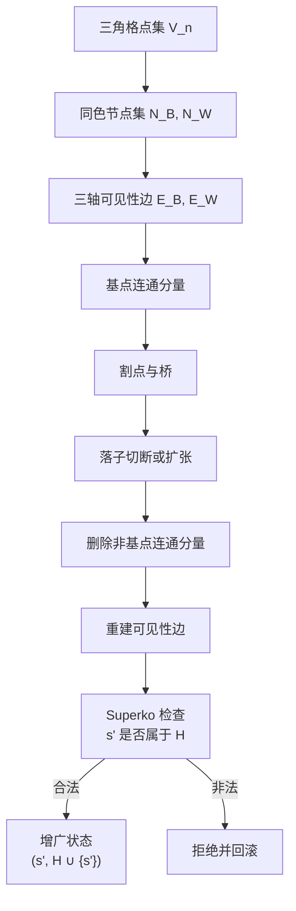

# Theory.md

## 摘要

本文将三角网格圈地博弈形式化为一个有限、确定、双人零和的图博弈。它的理论价值不在于单纯放大棋盘，也不在于堆砌状态数，而在于一个简洁规则同时制造了三类硬结构：长程可见性边、基点连通性删除、以及 Superko 带来的历史路径约束。局面估值因此不由局部占点数决定，而由桥、割点、极大连通分量和迫移局面共同决定。

最重要的规模结论如下。边长为 $n$ 的三角网格只有

$$
V(n)=\frac{n(n+1)}{2}=\Theta(n^2)
$$

个物理格点；但同轴可见性规则允许形成 $E(n)=\frac{n^3-n}{2}=\Theta(n^3)$ 条潜在长程逻辑边。其计数推导为

$$
E(n)=3\sum_{k=1}^{n}\binom{k}{2}
=3\binom{n+1}{3}
=\frac{n^3-n}{2}
=\Theta(n^3)
$$

复杂度的主要来源正在这里：局面承载在二次规模的格点上，战术关系却发生在三次规模的可见性边集上。一次落子可能切断一条桥，进而删除不再连回基点的极大连通分量；玩家有时还会被迫落子，亲手制造下一条可被切断的线。这种迫移结构使“多下一手”不再天然有利，也使传统策略窃取直觉失效。

本文刻意区分语义状态空间与表示空间。语义状态空间统计真正不同的局面；表示空间统计实现中显式缓存的边、线点或历史摘要。后者可以远大于前者，但不能用来宣称游戏本体状态数已经超过某个经典棋类。Superko 也应按增广状态 $(s,H)$ 理解：当前位置 $s$ 与历史集合 $H$ 共同决定合法性，并且每一步使 $|H|$ 严格增加。因此，DAG 结构存在于增广状态转移图中，而不是朴素的位置图中。

为避免误读，本文使用两个不同指标：状态空间描述“可能局面”的数量级；博弈树复杂度描述“可能对局路径”的数量级。二者不可互换。按常见文献口径，经典游戏的对比大致如下：

| 游戏 | 状态空间常用数量级 | 博弈树复杂度常用数量级 | 备注 |
|---|---:|---:|---|
| 国际象棋 | $10^{43}$ 到 $10^{50}$ | $10^{120}$ 到 $10^{123}$ | Shannon 给出 $10^{120}$ 级博弈树估计；状态空间估计随合法性口径变化。 |
| 中国象棋 | 约 $10^{40}$ 到 $10^{48}$ | 约 $10^{150}$ | 不同资料对可达状态空间估计差异较大；博弈树常被认为高于国际象棋。 |
| 19 路围棋 | $2.08\times 10^{170}$ | 约 $10^{360}$ | $19\times 19$ 合法局面数已有精确计数。 |
| 本游戏，语义上界 | $S_{\mathrm{pos}}(n)\le 2\cdot 5^{V(n)}$ | $\le 2^{2^{O(n^2)}}$ | 语义局面数未必超过围棋；关键在 $V(n)=\Theta(n^2)$ 与 $E(n)=\Theta(n^3)$ 的错位。 |
| 本游戏，显式表示上界 | $S_{\mathrm{repr}}(n)\le 2\cdot 5^{V(n)}3^{E(n)}$ | $\le 2^{2^{O(n^3)}}$ | 若把可见性边缓存也纳入表示对象，搜索表示空间升至 $2^{O(n^3)}$。 |

这张表的结论不是“本游戏在所有口径下都比围棋大”，而是更精确的一点：本游戏用二次规模的几何底盘生成三次规模的长程逻辑关系，并通过桥、割点、基点连通性与历史禁重复把这些关系转化为搜索深度。

## Definition

### 棋盘与轴线

固定棋盘边长 $n$。物理格点集定义为

$$
\mathcal V_n=\{(x,y)\in\mathbb Z_{\ge 0}^2:x+y\le n-1\}.
$$

其规模为

$$
|\mathcal V_n|=\sum_{y=0}^{n-1}(n-y)=\frac{n(n+1)}2.
$$

三族轴线分别为

$$
y=\mathrm{const},\qquad x=\mathrm{const},\qquad x+y=\mathrm{const}.
$$

黑方基点与白方基点记为

$$
r_B=(0,0),\qquad r_W=(n-1,0).
$$

### 节点、线点与可见性边

一个位置 $s$ 包含物理格点标记函数

$$
\sigma_s:\mathcal V_n\to
\{\emptyset,B_N,B_L,W_N,W_L\},
$$

以及当前行棋方 $p(s)\in\{B,W\}$。其中 $B_N,W_N$ 表示主动落下的节点，$B_L,W_L$ 表示由可见性边投影到棋盘上的线点。

对颜色 $c\in\{B,W\}$，令 $N_c(s)$ 为颜色 $c$ 的节点集。若 $u,v\in N_c(s)$ 位于同一轴线，且离散线段

$$
[u,v]\cap\mathcal V_n
$$

的内部不存在对方节点或对方线点，则 $u$ 与 $v$ 之间存在一条颜色 $c$ 的可见性边。于是得到同色逻辑图

$$
G_c(s)=(N_c(s),E_c(s)).
$$

线点不是独立的战略实体；它们是边 $E_c(s)$ 在物理格点上的投影。实现可以显式缓存线点与边集，但数学语义由节点、阻挡关系与可见性规则共同决定。

### 基点连通性

每一方的幸存节点必须连回自己的基点。形式化地，令

$$
C_c(s)
$$

为 $G_c(s)$ 中包含 $r_c$ 的极大连通分量。一次结算后，所有不属于 $C_c(s)$ 的颜色 $c$ 节点被删除；与这些节点相关的线点与边随之失效。这个规则将估值问题转化为基点连通性问题。

### 合法行动与结算算子

当前位置 $s$ 下，当前玩家 $c=p(s)$ 的行动是在某个格点 $v\in\mathcal V_n$ 落子。典型合法性条件包括：

$$
\sigma_s(v)\in\{\emptyset,\bar c_L\},
$$

且 $v$ 至少与一个己方节点同轴可见，并且不违反保护区、三点限制与 Superko 约束。落子后的结算可以写成确定性算子

$$
s'=\Phi_c(s,v).
$$

该算子按以下顺序执行：加入新节点；生成己方可见性边；若落在对方线点上，则切断相应对方边；删除对方不连回基点的极大连通分量；清理失效线点；对双方重新计算可见性边；最后检查 Superko。

## Derivation

### 物理格点数

第 $y$ 行有 $n-y$ 个格点，因此

$$
V(n)=\sum_{y=0}^{n-1}(n-y)
=\sum_{k=1}^{n}k
=\frac{n(n+1)}2
=\Theta(n^2).
$$

若只考虑相邻格点构成的单位邻接骨架，三族方向上长度分布均为 $1,2,\ldots,n$，单位边数为

$$
A(n)=3\sum_{k=1}^{n}(k-1)
=3\binom n2
=\frac{3n(n-1)}2
=\Theta(n^2).
$$

因此，底层三角晶格本身并不稠密。规则的非局部性来自可见性边，而不是来自单位邻接。

### 潜在长程边数

固定任意一族轴线。长度为 $k$ 的轴线包含 $\binom{k}{2}$ 个端点对。三族轴线的长度分布相同，均为 $1,2,\ldots,n$。因此潜在可见性边总数为

$$
E(n)=3\sum_{k=1}^{n}\binom{k}{2}
=3\binom{n+1}{3}
=\frac{n^3-n}{2}
=\Theta(n^3).
$$

这个计数没有重复。任意两个不同格点至多共享上述三族轴线中的一族。因此，每个同轴端点对对应唯一的潜在逻辑边。

### 割点、桥与连通分量

对颜色 $c$ 的逻辑图 $G_c(s)$，若删除顶点 $a$ 会使 $G_c(s)$ 的连通分量数增加，则 $a$ 是割点。若删除边 $e$ 会使连通分量数增加，则 $e$ 是桥。由于规则只保留包含基点 $r_c$ 的极大连通分量，桥的战略价值可以用断裂后的非基点侧规模刻画。

设 $e\in E_c(s)$ 是桥，删除 $e$ 后得到两个分量，其中不含 $r_c$ 的一侧记为

$$
T_c(e;s).
$$

则对手若能通过一次落子切断 $e$，至少会删除 $T_c(e;s)$ 中的全部节点，并清空其诱导线点。该手的直接结构收益可粗略写为

$$
\Delta(e;s)\approx |T_c(e;s)|+\lambda\,|\mathrm{Line}(T_c(e;s))|,
$$

其中 $\lambda$ 只表示线点对领土和后续可见性的权重，而非固定规则参数。若 $e$ 不是桥，切断它未必立即删除节点；但它可能降低边连通度，使后续攻击从“需要多次切断”降为“需要一次切断”。因此，真实估值依赖边连通度、点连通度和到基点的冗余路径，而不是依赖局部形状。

### Superko 与增广 DAG

令 $\mathcal S_{\mathrm{pos}}$ 为所有语义位置集合。若忽略 Superko，位置之间的确定性转移可形成有向图

$$
\Gamma_{\mathrm{pos}}=(\mathcal S_{\mathrm{pos}},\mathcal T).
$$

由于落子可能触发删除与重连，$\Gamma_{\mathrm{pos}}$ 可以含有有向环。Superko 的作用不是把 $\Gamma_{\mathrm{pos}}$ 静态地改造成 DAG；更准确的表述是：它把游戏状态提升为

$$
(s,H),\qquad s\in\mathcal S_{\mathrm{pos}},\quad H\subseteq\mathcal S_{\mathrm{pos}},
$$

其中 $H$ 是本局已经出现过的位置集合。转移规则为

$$
(s,H)\to(s',H\cup\{s'\})
\quad\Longleftrightarrow\quad
s'=\Phi_{p(s)}(s,v),\ s'\notin H.
$$

该增广转移图是 DAG，因为秩函数

$$
\rho(s,H)=|H|
$$

在每条合法边上严格增加。于是任意单局长度满足

$$
d_{\max}(n)\le |\mathcal S_{\mathrm{pos}}(n)|.
$$

若实现把显式边缓存也纳入位置哈希，则上界可替换为相应表示空间规模；但这描述的是实现状态，而非纯粹棋盘语义。

## Evaluation

### 语义状态空间

按五态格点标记和行棋方计数，有自然上界

$$
S_{\mathrm{pos}}(n)\le 2\cdot 5^{V(n)}
=2\cdot 5^{n(n+1)/2}.
$$

因此得到上界

$$
S_{\mathrm{pos}}(n)\le 2^{O(n^2)}.
$$

这是语义状态空间的保守上界。它仍然偏松，因为并非每个五态标记都满足线点由可见性边诱导、所有节点连回基点、保护区限制、三点限制等条件。真正合法位置数 $L(n)$ 满足

$$
L(n)\le S_{\mathrm{pos}}(n),
$$

但精确计数需要把上述约束同时编码。

### 表示空间

若实现把每条潜在边独立记录为黑、白或不存在三种状态，则得到显式表示空间上界

$$
S_{\mathrm{repr}}(n)
\le 2\cdot 5^{V(n)}\cdot 3^{E(n)}
=2\cdot 5^{n(n+1)/2}\cdot 3^{(n^3-n)/2}.
$$

因此得到上界

$$
S_{\mathrm{repr}}(n)\le 2^{O(n^3)}.
$$

这个量对工程搜索很重要，因为搜索器可能确实要维护边缓存、线点缓存和哈希。然而它不是语义局面数。将 $S_{\mathrm{repr}}(n)$ 与其他棋类的位置数直接比较，会混淆“游戏有多少不同局面”和“程序可能维护多少内部编码”。

### Superko 历史空间

若把历史集合也纳入马尔可夫状态，则有

$$
S_{\mathrm{aug}}(n)\le S_{\mathrm{pos}}(n)\cdot 2^{S_{\mathrm{pos}}(n)}.
$$

于是得到上界

$$
S_{\mathrm{aug}}(n)\le 2^{2^{O(n^2)}}.
$$

这说明 Superko 的状态代价极高，但它是历史自动机的代价，不应回灌为普通位置空间的规模。

### 数量级

| 指标 | 精确公式或上界 | 渐近阶 | $n=9$ | $n=15$ |
|---|---:|---:|---:|---:|
| 物理格点 $V(n)$ | $\frac{n(n+1)}2$ | $\Theta(n^2)$ | $45$ | $120$ |
| 单位邻接边 $A(n)$ | $\frac{3n(n-1)}2$ | $\Theta(n^2)$ | $108$ | $315$ |
| 潜在可见性边 $E(n)$ | $\frac{n^3-n}{2}$ | $\Theta(n^3)$ | $360$ | $1680$ |
| 语义上界 $S_{\mathrm{pos}}(n)$ | $2\cdot 5^{V(n)}$ | $2^{\Theta(n^2)}$ | $\approx 5.68\times 10^{31}$ | $\approx 1.51\times 10^{84}$ |
| 表示上界 $S_{\mathrm{repr}}(n)$ | $2\cdot 5^{V(n)}3^{E(n)}$ | $2^{\Theta(n^3)}$ | $\approx 3.24\times 10^{203}$ | $\approx 6.49\times 10^{885}$ |

结论很直接：语义局面数未必异常庞大；困难来自 $V(n)=\Theta(n^2)$ 与 $E(n)=\Theta(n^3)$ 的错位，以及切断边后触发的连通分量删除。

### 分支因子与搜索深度

即时合法行动集合记为

$$
\mathcal A(s)=\{v\in\mathcal V_n:v\text{ 满足落子、可见性、保护区、三点限制与 Superko 条件}\}.
$$

分支因子为

$$
b(s)=|\mathcal A(s)|.
$$

显然有

$$
b(s)\le V(n)=\Theta(n^2).
$$

在开局，合法点通常只分布在基点的若干可见轴线上，规模可低至 $O(n)$。进入中盘后，长程可见性边、敌方线点和反复释放的空格会使平均分支因子接近二次规模。因此，在缺乏真实对局统计前，合理的理论模型是

$$
\bar b(n)=\Theta(n^2),
$$

而不是常数或线性。

若没有删除机制，最长对局通常受 $V(n)$ 约束。这里不同：落子可以删除对方节点和线点，使格点重新变为空。深度不再由“棋盘被填满”控制，而由 Superko 禁止重复位置控制。因此

$$
d_{\max}(n)\le S_{\mathrm{pos}}(n)\le 2^{O(n^2)}.
$$

纯暴力 Minimax 的上界可写为

$$
T_{\mathrm{brute}}(n)=O\!\left(\bar b(n)^{d_{\max}(n)}\right)
\le 2^{2^{O(n^2)}}.
$$

若把显式表示空间作为深度上界，则得到更松的工程上界

$$
T_{\mathrm{repr}}(n)
=O\!\left((\Theta(n^2))^{2^{\Theta(n^3)}}\right).
$$

该界不应被解读为紧确复杂度定理。它说明的是：即使使用较保守的语义状态数，暴力强解也已经不可行。

### 复杂度类定位

目前不能仅凭直觉宣布该规则族为 PSPACE-hard、EXPTIME-hard 或 EXPTIME-complete。这样的结论需要显式归约。可行的归约路线应围绕以下结构展开：

1. 用基点连通的走廊表示布尔信号。
2. 用桥表示一次切断即可失效的脆弱信道。
3. 用割点实现扇入门，使一个节点的占领或切断改变多个分量的生死。
4. 用交替行棋模拟量词交替。
5. 用 Superko 历史集合实现不可回退门控，阻止信号恢复到旧配置。

在这样的归约完成前，严谨说法只能是：该规则族具有长程边、连通性删除和历史不重复三项高复杂度机制；它是强解困难的自然候选，而不是已经被证明落在某个复杂度完备类中的对象。

## AI Challenges

### 稀疏奖励与采样效率

若奖励只在终局由领土差给出，则中间大多数行动满足

$$
r_t=0.
$$

这会造成典型的稀疏奖励问题。更严重的是，决定终局差值的行动往往不是最后一次切断，而是若干回合前对桥、割点或备用路径的削弱。强化学习必须在很长的时间跨度上完成信用分配。单纯增加自博弈样本数只能线性改善覆盖率，却无法改变关键事件低概率、长延迟的事实。

更合理的训练目标应加入结构性辅助任务，例如预测：

$$
\Pr(v\in C_c(s)),
\qquad
\kappa_c(s)=\text{到基点的局部边连通度},
\qquad
\eta_c(s)=\text{一手内可被删除的节点数上界}.
$$

这些目标直接对应规则中的连通性风险，比“当前占了多少格点”更接近真实价值。

### CNN 的结构缺陷

卷积网络的归纳偏置是局部平移等变。它适合识别短程纹理，却不适合直接表示如下命题：

$$
v\text{ 是否与 }r_c\text{ 位于同一极大连通分量中};
$$

$$
e\text{ 是否为 }G_c(s)\text{ 的桥};
$$

$$
a\text{ 是否为 }G_c(s)\text{ 中控制多条长程边的割点}.
$$

这些性质不是局部卷积核能稳定捕捉的纹理。两个棋盘在局部窗口中可以几乎相同，但只要其中一个少了一条基点备用路径，真实价值就可能相反。增加卷积层深度可以扩大感受野，却不能保证学到图连通性的离散不变量。

### GNN 的自然性

更合适的表征是图神经网络。构造输入图

$$
\mathcal G(s)=(\mathcal V_n,\mathcal E_{\mathrm{unit}}\cup E_B(s)\cup E_W(s)),
$$

其中 $\mathcal E_{\mathrm{unit}}$ 表示单位邻接边，$E_B(s),E_W(s)$ 表示两方可见性边。节点特征包含格点状态、是否为基点、是否属于当前玩家、到边界的坐标嵌入等；边特征包含边类型、颜色、长度、是否穿过线点、是否可被当前行动切断等。

在该图上做消息传递，可以把基点信息沿可见性边传播到远端节点。更进一步，可以显式加入图算法特征：

$$
\mathrm{bridge}(e),\qquad
\mathrm{articulation}(v),\qquad
\mathrm{component\_id}(v),\qquad
\mathrm{dist}_{G_c}(v,r_c).
$$

这些特征不是装饰项，而是规则本身的充分统计量候选。模型若不知道桥和割点，就无法稳定评估一次切断的后果。

### 搜索与学习的结合

MCTS 在这里仍然有价值，但不能只依赖均值回传。应在扩展节点前执行连通性审计：

$$
\text{move }v\quad\mapsto\quad
\left(\Delta |C_B|,\Delta |C_W|,\Delta |\mathrm{Bridge}|,\Delta |\mathrm{Articulation}|\right).
$$

对会改变桥或割点状态的候选手，应提高搜索优先级。对可能触发大规模分量删除的手，应进行小深度验证搜索，而不是把它们交给随机 rollout 平均化。换言之，搜索策略应围绕图结构突变分配预算。

Superko 还要求网络或搜索节点携带历史摘要。只看当前棋盘的模型不是完整状态模型。工程上可以使用最近若干位置哈希、Bloom-filter 风格历史通道，或在树搜索节点中维护精确历史集合。无论采用哪种方案，都必须承认：

$$
s_t
$$

单独不足以决定合法行动；

$$
(s_t,H_t)
$$

才是规则意义下的状态。

## 结论

该博弈的理论结构可以概括为四点。

第一，棋盘规模为 $V(n)=\Theta(n^2)$，但潜在长程可见性边为 $E(n)=\Theta(n^3)$。这是复杂度的主因。

第二，语义状态空间与表示空间必须分开。$S_{\mathrm{pos}}(n)\le 2^{O(n^2)}$ 是语义局面上界；$S_{\mathrm{repr}}(n)\le 2^{O(n^3)}$ 是显式边缓存带来的表示上界。

第三，Superko 在增广状态 $(s,H)$ 上产生 DAG，因为 $|H|$ 严格增加。它限制对局深度，但也使合法性路径依赖。

第四，估值的关键变量是基点连通性、桥、割点和极大连通分量。面向 AI 的合理方向不是继续把棋盘当作图像纹理，而是把它作为动态可见性图处理，并把连通性风险纳入模型、搜索和辅助监督目标。
