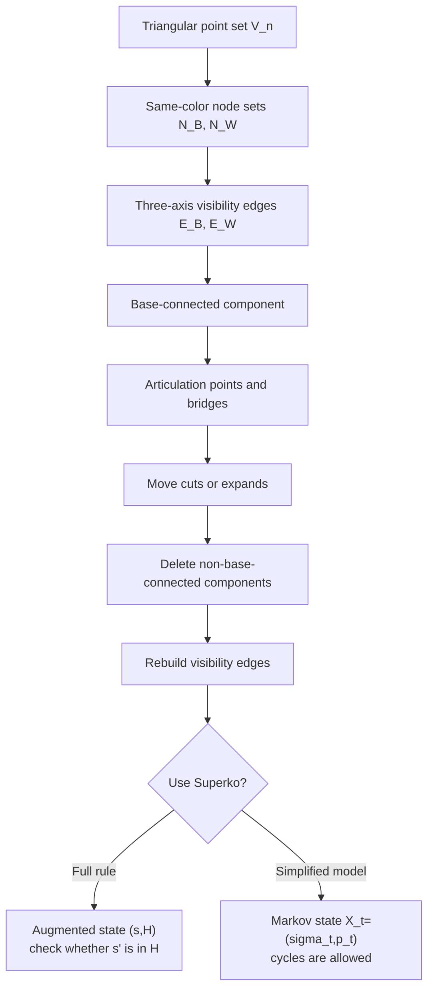

# Theory.md

## Abstract

This document formalizes the triangular territory game as a finite, deterministic, two-player zero-sum dynamic graph game. Its theoretical value is not simply that the board can be enlarged, nor that implementation caches can inflate a state count. The point is that a compact rule set creates three hard structures at once: long-range visibility edges, deletion by base connectivity, and path dependence caused by the global ban on repeated historical positions, namely Superko.

A triangular board of side length $n$ has only

$$
V(n)=\frac{n(n+1)}2=\Theta(n^2)
$$

physical lattice points. But the collinear visibility rule allows

$$
E(n)=3\sum_{k=1}^{n}\binom{k}{2}
=3\binom{n+1}{3}
=\frac{n^3-n}{2}
=\Theta(n^3)
$$

potential long-range logical edges. Thus the position lives on a quadratic-size board, while tactical relations live on a cubic-size visibility-edge set. A single move may cut a bridge and then delete an entire component that no longer connects back to its base. Sometimes a player is also forced to move in a way that creates the next vulnerable line. This non-monotonic structure breaks the usual strategy-stealing intuition that "one more friendly move cannot hurt".

The document combines two viewpoints. Under the full rule, Superko turns the rule state into an augmented state $(s,H)$, where $s$ is the current semantic position and $H$ is the set of positions already seen in the current game. Legality is determined by $(s,H)$, and every legal move strictly increases $|H|$, so the augmented transition graph is a DAG. If the global ban on repeated historical positions is temporarily ignored, the state can be compressed to the current board and player to move,

$$
X_t=(\sigma_t,p_t),
$$

which gives a simpler finite Markov model. Strictly speaking, before the two players' policies are fixed this is a finite turn-based Markov game; once both policies are fixed, it induces an ordinary Markov chain. This simplified version is useful for studying representation, cycles, and AI training, but it loses the natural single-game length bound supplied by Superko.

To avoid confusion, this document separates three scales: semantic state space counts genuinely different positions; representation space counts explicit cached edges, line points, and hashes maintained by an implementation; history space counts the historical set required by Superko. All three matter, but they should not be interchanged.

| Game or model | State-space scale | Path or search scale | Note |
|---|---:|---:|---|
| International chess | $10^{43}$ to $10^{50}$ | about $10^{120}$ | Shannon's classical game-tree estimate; state counts vary with legality conventions. |
| Chinese chess | about $10^{40}$ to $10^{48}$ | about $10^{150}$ | Reachable-state estimates vary widely; game-tree complexity is often considered higher than chess. |
| 19x19 Go | $2.08\times10^{170}$ | about $10^{360}$ | The legal position count is known exactly. |
| This game, semantic upper bound | $2\cdot5^{V(n)}$ | $\le 2^{2^{O(n^2)}}$ | Explicit edge caches are not counted as position semantics. |
| This game, explicit representation upper bound | $2\cdot5^{V(n)}3^{E(n)}$ | $\le 2^{2^{O(n^3)}}$ | If potential edge caches are treated as representation objects. |
| This game, no-Superko Markov compression | $2\cdot3^{V(n)}$ | cyclic unless termination is specified | Line points and edges are generated deterministically from nodes. |

The conclusion of the table is not "this game is larger than Go under every metric". The sharper claim is that the game uses a quadratic geometric substrate to generate cubic-scale long-range relations, then turns those relations into search depth through bridges, articulation points, root connectivity, zugzwang, and historical constraints.

## Definition

### Board and Axes

Fix a board side length $n$. The physical lattice point set is

$$
\mathcal V_n=\{(x,y)\in\mathbb Z_{\ge 0}^2:x+y\le n-1\}.
$$

Its size is

$$
|\mathcal V_n|=\sum_{y=0}^{n-1}(n-y)=\frac{n(n+1)}2.
$$

The three line families are

$$
y=\mathrm{const},\qquad x=\mathrm{const},\qquad x+y=\mathrm{const}.
$$

The black and white base points are denoted by

$$
r_B=(0,0),\qquad r_W=(n-1,0).
$$

### Nodes, Line Points, and Visibility Edges

A semantic position $s$ contains a physical lattice marking function

$$
\sigma_s:\mathcal V_n\to
\{\emptyset,B_N,B_L,W_N,W_L\},
$$

and a current player $p(s)\in\{B,W\}$. Here $B_N,W_N$ are actively placed nodes, while $B_L,W_L$ are line points projected onto the board by visibility edges.

For a color $c\in\{B,W\}$, let $N_c(s)$ be the node set of color $c$. If $u,v\in N_c(s)$ lie on the same axis, and the interior of the discrete segment

$$
[u,v]\cap\mathcal V_n
$$

contains no opponent node and no opponent line point, then a visibility edge of color $c$ exists between $u$ and $v$. This gives the monochromatic logical graph

$$
G_c(s)=(N_c(s),E_c(s)).
$$

Line points are not independent strategic objects. They are projections of edges $E_c(s)$ onto physical lattice points. An implementation may explicitly cache line points and edge sets, but the mathematical semantics are determined by nodes, blocking relations, and the visibility rule.

### Base Connectivity

Every surviving node of a side must connect back to that side's base. Formally, let

$$
C_c(s)
$$

be the maximal connected component of $G_c(s)$ containing $r_c$. After resolution, every color-$c$ node outside $C_c(s)$ is deleted; line points and edges associated with those nodes become invalid. This rule turns evaluation into a root-connectivity problem.

### Legal Actions and the Resolution Operator

At position $s$, the current player $c=p(s)$ acts by placing a node at some lattice point $v\in\mathcal V_n$. Typical legality conditions include

$$
\sigma_s(v)\in\{\emptyset,\bar c_L\},
$$

where $v$ must also be collinearly visible to at least one friendly node and must respect the protection zone, the three-point restriction, and the chosen history rule. Post-move resolution can be written as a deterministic operator

$$
s'=\Phi_c(s,v).
$$

This operator executes in order: add the new node; generate friendly visibility edges; if the move landed on an opponent line point, cut the corresponding opponent edge; delete opponent maximal components that no longer connect back to their base; clean invalid line points; recompute visibility edges for both sides; finally apply Superko or the chosen repeated-position rule.

### Full State and Markov Simplification

Under the full rule, the state should be written as

$$
(s,H),\qquad H\subseteq\mathcal S_{\mathrm{pos}},
$$

where $H$ is the set of semantic positions that have already appeared in the current game. A legal transition is

$$
(s,H)\to(s',H\cup\{s'\})
\quad\Longleftrightarrow\quad
s'=\Phi_{p(s)}(s,v),\ s'\notin H.
$$

If the global ban on repeated historical positions is ignored, the history set can be removed and the compressed state is

$$
X_t=(\sigma_t,p_t).
$$

If line points and visibility edges are generated deterministically from nodes, $\sigma_t$ may record only a three-state node array: empty, black node, or white node. The state upper bound then becomes

$$
|\mathcal X_n|\le 2\cdot3^{V(n)}.
$$

This is the cleaner Markovized version: the next-step distribution depends only on the current $X_t$ and the current action, not on older history. It is a useful baseline for learning and search, but it must specify the payoff of repeated states, draws, or a move limit; otherwise play may cycle in the finite state graph.

## Derivation

### Physical Lattice Points

Row $y$ has $n-y$ lattice points, so

$$
V(n)=\sum_{y=0}^{n-1}(n-y)
=\sum_{k=1}^{n}k
=\frac{n(n+1)}2
=\Theta(n^2).
$$

If only the unit-adjacency skeleton between neighboring lattice points is considered, the three direction families all have length distribution $1,2,\ldots,n$, so the number of unit edges is

$$
A(n)=3\sum_{k=1}^{n}(k-1)
=3\binom n2
=\frac{3n(n-1)}2
=\Theta(n^2).
$$

Thus the underlying triangular lattice is not dense. The non-locality of the rules comes from visibility edges, not from unit adjacency.

### Potential Long-Range Edges

Fix any one axis family. An axis line of length $k$ contains $\binom{k}{2}$ endpoint pairs. The three axis families have the same length distribution $1,2,\ldots,n$. Therefore the total number of potential visibility edges is

$$
E(n)=3\sum_{k=1}^{n}\binom{k}{2}
=3\binom{n+1}{3}
=\frac{n^3-n}{2}
=\Theta(n^3).
$$

This count has no duplication. Any two distinct lattice points share at most one of the three axis families, so each collinear endpoint pair corresponds to exactly one potential logical edge.

### Articulation Points, Bridges, and Connected Components

For the logical graph $G_c(s)$ of color $c$, a vertex $a$ is an articulation point if deleting $a$ increases the number of connected components of $G_c(s)$. An edge $e$ is a bridge if deleting $e$ increases the number of connected components. Because the rule keeps only the maximal component containing base $r_c$, the strategic value of a bridge can be described by the size of the non-base side after the cut.

Let $e\in E_c(s)$ be a bridge. Deleting $e$ gives two components; denote the side that does not contain $r_c$ by

$$
T_c(e;s).
$$

If the opponent can cut $e$ with one move, then at least all nodes in $T_c(e;s)$ will be deleted, together with their induced line points. A rough direct structural gain can be written as

$$
\Delta(e;s)\approx |T_c(e;s)|+\lambda\,|\mathrm{Line}(T_c(e;s))|,
$$

where $\lambda$ only represents the weight of line points for territory and future visibility; it is not a fixed rule parameter. If $e$ is not a bridge, cutting it may not delete nodes immediately. But it may reduce edge connectivity, turning a future attack from "requires several cuts" into "requires one cut". Real evaluation therefore depends on edge connectivity, vertex connectivity, and redundant paths back to the base, not merely local shape.

### Superko and the Augmented DAG

Let $\mathcal S_{\mathrm{pos}}$ be the set of all semantic positions. If Superko is ignored, deterministic transitions between positions form a directed graph

$$
\Gamma_{\mathrm{pos}}=(\mathcal S_{\mathrm{pos}},\mathcal T).
$$

Because a move may trigger deletion and reconnection, $\Gamma_{\mathrm{pos}}$ may contain directed cycles. Superko does not statically turn $\Gamma_{\mathrm{pos}}$ into a DAG. More accurately, it lifts the game state to $(s,H)$. The augmented transition graph is a DAG because the rank function

$$
\rho(s,H)=|H|
$$

strictly increases on every legal edge. Therefore any single-game length satisfies

$$
d_{\max}(n)\le |\mathcal S_{\mathrm{pos}}(n)|.
$$

If an implementation includes explicit edge caches in the position hash, the bound may be replaced by the corresponding representation-space size. That describes implementation state, not pure board semantics.

### The no-Superko Markov-Chain View

If Superko is ignored, the state is simply $X_t=(\sigma_t,p_t)$. Before player policies are fixed, the transition system is a finite Markov game:

$$
P(X_{t+1}=y\mid X_t=x,a_t)=\mathbf 1[y=\Phi(x,a_t)].
$$

If black and white policies $\pi_B,\pi_W$ are fixed, it induces an ordinary Markov chain

$$
P_\pi(x,y)=
\sum_{a\in\mathcal A(x)}
\pi_{p(x)}(a\mid x)\,\mathbf 1[y=\Phi(x,a)].
$$

This viewpoint gives three simplifying conclusions.

1. Legality no longer depends on a history set, so state learning is easier and the network does not need an exact history summary.
2. The state graph may contain cycles, so maximum game length is no longer naturally bounded by the number of states unless a draw rule, two-pass ending rule, or move limit is added.
3. If terminal positions are made absorbing, the problem can be analyzed as absorption probabilities, expected returns, and expected hitting times in an absorbing Markov chain or stochastic game.

In short, the no-Superko model is a useful simplified baseline, but not an equivalent substitute for the full rule. It removes historical complexity while exposing the separate issues of cyclic payoffs, repeated positions, and termination semantics.

## Evaluation

### Semantic State Space

Counting five-state lattice markings and the player to move gives the natural upper bound

$$
S_{\mathrm{pos}}(n)\le 2\cdot 5^{V(n)}
=2\cdot 5^{n(n+1)/2}
\le 2^{O(n^2)}.
$$

This is a conservative upper bound on semantic state space. It is still loose, because not every five-state marking satisfies the constraints that line points must be induced by visibility edges, all nodes must connect back to their base, protection zones must hold, and the three-point restriction must be respected. The true number of legal positions $L(n)$ satisfies

$$
L(n)\le S_{\mathrm{pos}}(n).
$$

### Representation Space

If an implementation independently records each potential edge as black, white, or absent, an explicit representation-space upper bound is

$$
S_{\mathrm{repr}}(n)
\le 2\cdot 5^{V(n)}\cdot 3^{E(n)}
=2\cdot 5^{n(n+1)/2}\cdot 3^{(n^3-n)/2}
\le 2^{O(n^3)}.
$$

This quantity matters for engineering search, because a searcher may indeed maintain edge caches, line-point caches, and hashes. But it is not the semantic position count. Directly comparing $S_{\mathrm{repr}}(n)$ with the position counts of other board games conflates "how many different positions the game has" with "how many internal encodings a program may maintain".

### Superko History Space

If the history set is included in the Markov state, then

$$
S_{\mathrm{aug}}(n)
\le S_{\mathrm{pos}}(n)\cdot 2^{S_{\mathrm{pos}}(n)}
\le 2^{2^{O(n^2)}}.
$$

This shows that Superko has a very high state cost, but that cost belongs to the historical automaton. It should not be folded back into the ordinary position-space scale.

### no-Superko Compressed Space

If the global ban on repeated historical positions is ignored, and line points and edges are generated deterministically from nodes, a three-state node-array encoding can be used:

$$
S_{\mathrm{Markov}}(n)\le 2\cdot3^{V(n)}
=2\cdot3^{n(n+1)/2}
=2^{O(n^2)}.
$$

For $n=9$ and $n=15$,

$$
S_{\mathrm{Markov}}(9)\lesssim 5.9\times10^{21},
\qquad
S_{\mathrm{Markov}}(15)\lesssim 3.6\times10^{57}.
$$

This is far smaller than the explicit two-layer representation bound, but the difficulty does not disappear. Evaluation still depends on bridges, articulation points, root connectivity, and cascading deletion in the dynamic visibility graph.

### Orders of Magnitude

| Metric | Exact formula or upper bound | Asymptotic order | $n=9$ | $n=15$ |
|---|---:|---:|---:|---:|
| Physical points $V(n)$ | $\frac{n(n+1)}2$ | $\Theta(n^2)$ | $45$ | $120$ |
| Unit-adjacency edges $A(n)$ | $\frac{3n(n-1)}2$ | $\Theta(n^2)$ | $108$ | $315$ |
| Potential visibility edges $E(n)$ | $\frac{n^3-n}{2}$ | $\Theta(n^3)$ | $360$ | $1680$ |
| Semantic upper bound $S_{\mathrm{pos}}(n)$ | $2\cdot5^{V(n)}$ | $2^{\Theta(n^2)}$ | $\approx5.68\times10^{31}$ | $\approx1.51\times10^{84}$ |
| Representation upper bound $S_{\mathrm{repr}}(n)$ | $2\cdot5^{V(n)}3^{E(n)}$ | $2^{\Theta(n^3)}$ | $\approx3.24\times10^{203}$ | $\approx6.49\times10^{885}$ |
| no-Superko compressed upper bound $S_{\mathrm{Markov}}(n)$ | $2\cdot3^{V(n)}$ | $2^{\Theta(n^2)}$ | $\approx5.91\times10^{21}$ | $\approx3.59\times10^{57}$ |

The conclusion is direct: state encoding can be compressed, but structural complexity does not shrink proportionally. The difficulty comes from the mismatch between $V(n)=\Theta(n^2)$ and $E(n)=\Theta(n^3)$, and from connected-component deletion triggered after edges are cut.

### Branching Factor and Search Depth

Let the immediate legal action set be

$$
\mathcal A(s)=\{v\in\mathcal V_n:v\text{ satisfies move, visibility, protection-zone, three-point, and history conditions}\}.
$$

The branching factor is

$$
b(s)=|\mathcal A(s)|\le V(n)=\Theta(n^2).
$$

In the opening, legal points are usually distributed only on several visible axes from the bases, so the scale can be as low as $O(n)$. In the middlegame, long-range visibility edges, enemy line points, and repeatedly released empty points can push the average branching factor closer to quadratic scale. Until real game statistics are available, a reasonable theoretical model is

$$
\bar b(n)=\Theta(n^2).
$$

Under the full Superko rule, depth is controlled by historical non-repetition:

$$
d_{\max}(n)\le S_{\mathrm{pos}}(n)\le 2^{O(n^2)}.
$$

Under the no-Superko rule, the state graph may contain cycles. Without a draw rule for repeated states, a two-pass ending rule, or a move limit, there is generally no uniform finite maximum game length. If "stop at first repeated state" or a move limit is added, then

$$
d_{\max}(n)\le S_{\mathrm{Markov}}(n)-1=\exp(\Theta(n^2)).
$$

Thus brute-force search under such a finite convention can still reach

$$
T_{\mathrm{brute}}(n)=O(\bar b(n)^{d_{\max}(n)})
=\exp(\exp(\Theta(n^2))).
$$

If the game is further replaced by a monotone variant where every point can be effectively occupied only once, then $d(n)=\Theta(n^2)$ and the search bound falls to

$$
T_{\mathrm{mono}}(n)=\exp(\Theta(n^2\log n)).
$$

### Complexity-Class Positioning

At present, it is not rigorous to declare this rule family PSPACE-hard, EXPTIME-hard, or EXPTIME-complete by intuition alone. Such claims require an explicit reduction. A plausible reduction path would need to use the following structures:

1. Use base-connected corridors to represent Boolean signals.
2. Use bridges as fragile channels that fail after one cut.
3. Use articulation points to implement fan-in gates, where occupying or cutting one node changes the survival of several components.
4. Use alternating turns to simulate quantifier alternation.
5. In the full rule, use the Superko history set as irreversible gating; in the no-Superko simplification, replace that gate with an explicit termination or cyclic-payoff convention.

The rigorous statement is: this rule family contains several high-complexity mechanisms, namely long-range edges, root-connectivity deletion, non-monotone zugzwang, and historical constraints. It is a natural candidate for hard strong solving, not an object already proven complete for a specific complexity class.

## AI Challenges

### Sparse Rewards and Sample Efficiency

If reward is given only at the terminal state by territory difference, then most intermediate actions satisfy

$$
r_t=0.
$$

This creates the standard sparse-reward problem. Worse, the actions that decide the final territory difference are often not the final cut, but earlier moves that weakened a bridge, articulation point, or backup path several turns before. Reinforcement learning must assign credit over a long temporal span.

A more reasonable training objective should include structural auxiliary tasks, such as predicting:

$$
\Pr(v\in C_c(s)),
\qquad
\kappa_c(s)=\text{local edge connectivity back to the base},
\qquad
\eta_c(s)=\text{upper bound on nodes deletable in one move}.
$$

These targets correspond directly to connectivity risk in the rules, and are closer to real value than "how many points are currently occupied".

### Structural Weaknesses of CNNs

The inductive bias of a convolutional network is local translation equivariance. It is good for short-range texture, but not for directly representing propositions such as:

$$
v\text{ is in the same maximal connected component as }r_c;
$$

$$
e\text{ is a bridge of }G_c(s);
$$

$$
a\text{ is an articulation point controlling several long-range edges in }G_c(s).
$$

These properties are not textures that local convolution kernels can reliably capture. Two boards may be almost identical in every local window, yet if one has one fewer backup path to the base, its true value may be the opposite.

### Naturalness of GNNs

A more suitable representation is a graph neural network. Construct the input graph

$$
\mathcal G(s)=(\mathcal V_n,\mathcal E_{\mathrm{unit}}\cup E_B(s)\cup E_W(s)),
$$

where $\mathcal E_{\mathrm{unit}}$ is the unit-adjacency edge set, and $E_B(s),E_W(s)$ are both players' visibility edges. Node features include lattice state, whether the node is a base, whether it belongs to the current player, coordinate embeddings, and so on. Edge features include edge type, color, length, whether it passes through line points, and whether the current action can cut it.

Message passing on this graph can propagate base information along visibility edges to distant nodes. More directly, graph-algorithm features can be included:

$$
\mathrm{bridge}(e),\qquad
\mathrm{articulation}(v),\qquad
\mathrm{component\_id}(v),\qquad
\mathrm{dist}_{G_c}(v,r_c).
$$

These features are not decorative. They are candidate sufficient statistics of the rules. If the model does not know bridges and articulation points, it cannot stably evaluate the consequence of a cut.

### Combining Search and Learning

MCTS is still valuable here, but it should not rely only on mean backup. Before expanding a node, the search should run a connectivity audit:

$$
\text{move }v\quad\mapsto\quad
\left(\Delta |C_B|,\Delta |C_W|,\Delta |\mathrm{Bridge}|,\Delta |\mathrm{Articulation}|\right).
$$

Candidate moves that change bridge or articulation status should receive higher search priority. Moves that may trigger large component deletion should receive shallow verification search instead of being averaged away by random rollouts.

The full Superko rule requires the network or search node to carry a history summary. The no-Superko simplification removes that burden, but must handle state cycles. Engineering choices for the former include recent position hashes, Bloom-filter-like history channels, or exact history sets inside tree-search nodes. Engineering choices for the latter include transposition tables, cycle detection, and a clear payoff convention for repeated positions. The two models are difficult for different reasons: historical memory versus cyclic semantics.

## Conclusion

The theoretical structure of this game can be summarized in five points.

First, board size is $V(n)=\Theta(n^2)$, but the number of potential long-range visibility edges is $E(n)=\Theta(n^3)$. This is the main source of complexity.

Second, semantic state space and representation space must be separated. $S_{\mathrm{pos}}(n)\le2^{O(n^2)}$ is the semantic position upper bound; $S_{\mathrm{repr}}(n)\le2^{O(n^3)}$ is the representation upper bound introduced by explicit edge caches.

Third, Superko creates a DAG over augmented states $(s,H)$ because $|H|$ strictly increases. It limits game depth, but also makes legality path-dependent.

Fourth, if the global ban on repeated historical positions is ignored, the problem simplifies to a finite Markov game; after policies are fixed, it induces a Markov chain. This version has a smaller state description and is easier to learn from, but its state graph may contain cycles, so repeated-state and termination semantics must be specified separately.

Fifth, the key evaluation variables are base connectivity, bridges, articulation points, maximal connected components, and zugzwang risk. The sensible AI direction is not to keep treating the board as image texture, but to process it as a dynamic visibility graph and include connectivity risk in the model, search, and auxiliary supervision targets.
