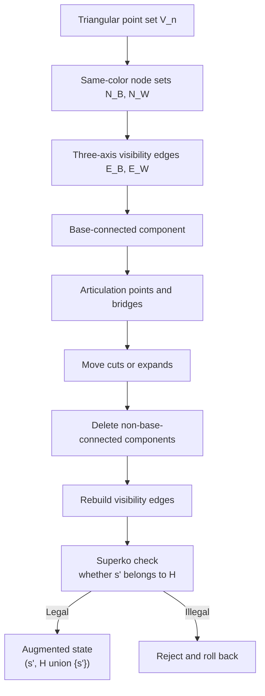

# Theory.md

## Abstract

This document formalizes the triangular territory game as a finite, deterministic, two-player zero-sum graph game. Its advantage over classical games such as chess, Go, and checkers is not the crude claim that its intrinsic position count is always larger. The advantage is structural density: a small geometric board produces a much richer long-range relation graph. For reference, checkers is commonly placed around $5\times 10^{20}$ states and roughly $10^{31}$ game-tree complexity; chess is often estimated around $10^{43}$ to $10^{50}$ states and $10^{120}$ game-tree complexity; 19x19 Go has $2.08\times 10^{170}$ legal positions and is often estimated near $10^{360}$ game-tree complexity. At side length $n=15$, this game has only $V=120$ physical lattice points, but already has $E=1680$ potential long-range visibility edges, giving an explicit representation upper bound of about $6.49\times 10^{885}$. In short, the game does not buy complexity by making the board enormous; it turns a quadratic board into cubic tactical relations, then turns those relations into search depth through cuts, connectivity deletion, and Superko.

Its theoretical value is therefore not merely that the board can be enlarged, nor that state counts can be inflated. The point is that one compact rule set creates three hard structures at once: long-range visibility edges, deletion by base connectivity, and historical path constraints introduced by Superko. Position evaluation is therefore not determined by local point count, but by bridges, articulation points, maximal connected components, and zugzwang-like positions.

The most important scale result is this. A triangular lattice with side length $n$ has only

$$
V(n)=\frac{n(n+1)}{2}=\Theta(n^2)
$$

physical lattice points, but the collinear visibility rule allows $E(n)=\frac{n^3-n}{2}=\Theta(n^3)$ potential long-range logical edges. The count is

$$
E(n)=3\sum_{k=1}^{n}\binom{k}{2}
=3\binom{n+1}{3}
=\frac{n^3-n}{2}
=\Theta(n^3).
$$

This is the main source of complexity: the position lives on a quadratic number of physical points, while tactical relations happen over a cubic-scale visibility edge set. A single move may cut a bridge and then delete a maximal connected component that no longer reaches its base. A player may also be forced to play a move that creates the next vulnerable line. This zugzwang structure means that "one more friendly move" is not automatically useful, and it breaks the usual intuition behind strategy stealing.

This document deliberately separates semantic state space from representation space. Semantic state space counts genuinely different positions. Representation space counts explicit cached edges, line points, or historical summaries maintained by an implementation. The latter can be much larger than the former, but it cannot be used to claim that the intrinsic state count of the game already exceeds some classical board game. Superko should also be understood through the augmented state $(s,H)$: the current position $s$ and the history set $H$ jointly determine legality, and every legal move strictly increases $|H|$. Therefore, the DAG structure exists in the augmented transition graph, not in the naive position graph.

To avoid misreading, the document uses two different metrics: state space describes the order of magnitude of "possible positions"; game-tree complexity describes the order of magnitude of "possible play paths". They are not interchangeable. Under common literature conventions, a rough comparison with classical games is:

| Game | Common state-space scale | Common game-tree complexity scale | Note |
|---|---:|---:|---|
| Checkers | about $5\times 10^{20}$ | about $10^{31}$ | Strongly solved; much smaller than chess and Go by these common scales. |
| International chess | $10^{43}$ to $10^{50}$ | $10^{120}$ to $10^{123}$ | Shannon gave a $10^{120}$-scale game-tree estimate; state-space estimates vary with legality conventions. |
| Chinese chess | about $10^{40}$ to $10^{48}$ | about $10^{150}$ | Estimates of reachable state space vary widely; game-tree complexity is often considered higher than international chess. |
| 19x19 Go | $2.08\times 10^{170}$ | about $10^{360}$ | The number of legal $19\times 19$ positions has an exact count. |
| This game, semantic upper bound | $S_{\mathrm{pos}}(n)\le 2\cdot 5^{V(n)}$ | $\le 2^{2^{O(n^2)}}$ | Semantic position count need not exceed Go; the key is the mismatch between $V(n)=\Theta(n^2)$ and $E(n)=\Theta(n^3)$. |
| This game, explicit representation upper bound | $S_{\mathrm{repr}}(n)\le 2\cdot 5^{V(n)}3^{E(n)}$ | $\le 2^{2^{O(n^3)}}$ | If visibility-edge caches are counted as representation objects, the search representation space rises to $2^{O(n^3)}$. |

The conclusion of this table is not "this game is larger than Go under every metric". The sharper conclusion is that this game uses a quadratic geometric substrate to generate cubic-scale long-range logical relations, then turns those relations into search depth through bridges, articulation points, base connectivity, and historical non-repetition.

## Definition

### Board and Axes

Fix a board side length $n$. The physical lattice point set is

$$
\mathcal V_n=\{(x,y)\in\mathbb Z_{\ge 0}^2:x+y\le n-1\}.
$$

Its size is

$$
|\mathcal V_n|=\sum_{y=0}^{n-1}(n-y)=\frac{n(n+1)}2.
$$

The three line families are

$$
y=\mathrm{const},\qquad x=\mathrm{const},\qquad x+y=\mathrm{const}.
$$

The black and white base points are denoted by

$$
r_B=(0,0),\qquad r_W=(n-1,0).
$$

### Nodes, Line Points, and Visibility Edges

A position $s$ contains a physical lattice marking function

$$
\sigma_s:\mathcal V_n\to
\{\emptyset,B_N,B_L,W_N,W_L\},
$$

and a current player $p(s)\in\{B,W\}$. Here $B_N,W_N$ are actively placed nodes, while $B_L,W_L$ are line points projected onto the board by visibility edges.

For a color $c\in\{B,W\}$, let $N_c(s)$ be the node set of color $c$. If $u,v\in N_c(s)$ lie on the same axis, and the interior of the discrete segment

$$
[u,v]\cap\mathcal V_n
$$

contains no opponent node and no opponent line point, then a visibility edge of color $c$ exists between $u$ and $v$. This gives the monochromatic logical graph

$$
G_c(s)=(N_c(s),E_c(s)).
$$

Line points are not independent strategic entities; they are projections of edges $E_c(s)$ onto physical lattice points. An implementation may explicitly cache line points and edge sets, but the mathematical semantics are jointly determined by nodes, blocking relations, and the visibility rule.

### Base Connectivity

Every surviving node of a side must connect back to that side's base. Formally, let

$$
C_c(s)
$$

be the maximal connected component of $G_c(s)$ containing $r_c$. After resolution, every color-$c$ node outside $C_c(s)$ is deleted; line points and edges associated with those nodes become invalid. This rule turns evaluation into a base-connectivity problem.

### Legal Actions and the Resolution Operator

At position $s$, the current player $c=p(s)$ acts by placing a node at some lattice point $v\in\mathcal V_n$. Typical legality conditions include

$$
\sigma_s(v)\in\{\emptyset,\bar c_L\},
$$

where the point is empty or an opponent line point, and $v$ must be collinearly visible to at least one friendly node. The move must also respect the protection zone, the three-point restriction, and Superko. Post-move resolution can be written as a deterministic operator

$$
s'=\Phi_c(s,v).
$$

This operator executes in order: add the new node; generate friendly visibility edges; if the move landed on an opponent line point, cut the corresponding opponent edge; delete opponent maximal components that no longer connect back to their base; clean invalid line points; recompute visibility edges for both sides; finally check Superko.

## Derivation

### Physical Lattice Points

Row $y$ has $n-y$ lattice points, so

$$
V(n)=\sum_{y=0}^{n-1}(n-y)
=\sum_{k=1}^{n}k
=\frac{n(n+1)}2
=\Theta(n^2).
$$

If only the unit-adjacency skeleton between neighboring lattice points is considered, the three direction families all have length distribution $1,2,\ldots,n$, so the number of unit edges is

$$
A(n)=3\sum_{k=1}^{n}(k-1)
=3\binom n2
=\frac{3n(n-1)}2
=\Theta(n^2).
$$

Thus the underlying triangular crystal lattice is not dense. The non-locality of the rules comes from visibility edges, not from unit adjacency.

### Potential Long-Range Edges

Fix any one axis family. An axis line of length $k$ contains $\binom{k}{2}$ endpoint pairs. The three axis families have the same length distribution $1,2,\ldots,n$. Therefore the total number of potential visibility edges is

$$
E(n)=3\sum_{k=1}^{n}\binom{k}{2}
=3\binom{n+1}{3}
=\frac{n^3-n}{2}
=\Theta(n^3).
$$

This count has no duplication. Any two distinct lattice points share at most one of the three axis families, so each collinear endpoint pair corresponds to exactly one potential logical edge.

### Articulation Points, Bridges, and Connected Components

For the logical graph $G_c(s)$ of color $c$, a vertex $a$ is an articulation point if deleting $a$ increases the number of connected components of $G_c(s)$. An edge $e$ is a bridge if deleting $e$ increases the number of connected components. Because the rule keeps only the maximal component containing base $r_c$, the strategic value of a bridge can be described by the size of the non-base side after the cut.

Let $e\in E_c(s)$ be a bridge. Deleting $e$ gives two components; denote the side that does not contain $r_c$ by

$$
T_c(e;s).
$$

If the opponent can cut $e$ with one move, then at least all nodes in $T_c(e;s)$ will be deleted, together with their induced line points. A rough direct structural gain can be written as

$$
\Delta(e;s)\approx |T_c(e;s)|+\lambda\,|\mathrm{Line}(T_c(e;s))|,
$$

where $\lambda$ only represents the weight of line points for territory and future visibility; it is not a fixed rule parameter. If $e$ is not a bridge, cutting it may not delete nodes immediately. But it may reduce edge connectivity, turning a future attack from "requires several cuts" into "requires one cut". Real evaluation therefore depends on edge connectivity, vertex connectivity, and redundant paths back to the base, not merely local shape.

### Superko and the Augmented DAG

Let $\mathcal S_{\mathrm{pos}}$ be the set of all semantic positions. If Superko is ignored, deterministic transitions between positions form a directed graph

$$
\Gamma_{\mathrm{pos}}=(\mathcal S_{\mathrm{pos}},\mathcal T).
$$

Because a move may trigger deletion and reconnection, $\Gamma_{\mathrm{pos}}$ may contain directed cycles. Superko does not statically turn $\Gamma_{\mathrm{pos}}$ into a DAG. More accurately, it lifts the game state to

$$
(s,H),\qquad s\in\mathcal S_{\mathrm{pos}},\quad H\subseteq\mathcal S_{\mathrm{pos}},
$$

where $H$ is the set of positions that have already appeared in the current game. The transition rule is

$$
(s,H)\to(s',H\cup\{s'\})
\quad\Longleftrightarrow\quad
s'=\Phi_{p(s)}(s,v),\ s'\notin H.
$$

The augmented transition graph is a DAG because the rank function

$$
\rho(s,H)=|H|
$$

strictly increases on every legal edge. Therefore any single-game length satisfies

$$
d_{\max}(n)\le |\mathcal S_{\mathrm{pos}}(n)|.
$$

If an implementation includes explicit edge caches in the position hash, the bound may be replaced by the corresponding representation-space size. That describes implementation state, not pure board semantics.

## Evaluation

### Semantic State Space

Counting five-state lattice markings and the player to move gives the natural upper bound

$$
S_{\mathrm{pos}}(n)\le 2\cdot 5^{V(n)}
=2\cdot 5^{n(n+1)/2}.
$$

Thus

$$
S_{\mathrm{pos}}(n)\le 2^{O(n^2)}.
$$

This is a conservative upper bound on semantic state space. It is still loose, because not every five-state marking satisfies the constraints that line points must be induced by visibility edges, all nodes must connect back to their base, protection zones must hold, and the three-point restriction must be respected. The true number of legal positions $L(n)$ satisfies

$$
L(n)\le S_{\mathrm{pos}}(n),
$$

but an exact count would need to encode all of the above constraints at once.

### Representation Space

If an implementation independently records each potential edge as black, white, or absent, an explicit representation-space upper bound is

$$
S_{\mathrm{repr}}(n)
\le 2\cdot 5^{V(n)}\cdot 3^{E(n)}
=2\cdot 5^{n(n+1)/2}\cdot 3^{(n^3-n)/2}.
$$

Therefore

$$
S_{\mathrm{repr}}(n)\le 2^{O(n^3)}.
$$

This quantity matters for engineering search, because a searcher may indeed maintain edge caches, line-point caches, and hashes. But it is not the semantic position count. Directly comparing $S_{\mathrm{repr}}(n)$ with the position counts of other board games conflates "how many different positions the game has" with "how many internal encodings a program may maintain".

### Superko History Space

If the history set is included in the Markov state, then

$$
S_{\mathrm{aug}}(n)\le S_{\mathrm{pos}}(n)\cdot 2^{S_{\mathrm{pos}}(n)}.
$$

Thus

$$
S_{\mathrm{aug}}(n)\le 2^{2^{O(n^2)}}.
$$

This shows that Superko has a very high state cost, but that cost belongs to the historical automaton. It should not be folded back into the ordinary position-space scale.

### Orders of Magnitude

| Metric | Exact formula or upper bound | Asymptotic order | $n=9$ | $n=15$ |
|---|---:|---:|---:|---:|
| Physical points $V(n)$ | $\frac{n(n+1)}2$ | $\Theta(n^2)$ | $45$ | $120$ |
| Unit-adjacency edges $A(n)$ | $\frac{3n(n-1)}2$ | $\Theta(n^2)$ | $108$ | $315$ |
| Potential visibility edges $E(n)$ | $\frac{n^3-n}{2}$ | $\Theta(n^3)$ | $360$ | $1680$ |
| Semantic upper bound $S_{\mathrm{pos}}(n)$ | $2\cdot 5^{V(n)}$ | $2^{\Theta(n^2)}$ | $\approx 5.68\times 10^{31}$ | $\approx 1.51\times 10^{84}$ |
| Representation upper bound $S_{\mathrm{repr}}(n)$ | $2\cdot 5^{V(n)}3^{E(n)}$ | $2^{\Theta(n^3)}$ | $\approx 3.24\times 10^{203}$ | $\approx 6.49\times 10^{885}$ |

The conclusion is direct: the semantic position count need not be exceptionally huge. The difficulty comes from the mismatch between $V(n)=\Theta(n^2)$ and $E(n)=\Theta(n^3)$, and from connected-component deletion triggered after edges are cut.

### Branching Factor and Search Depth

Let the immediate legal action set be

$$
\mathcal A(s)=\{v\in\mathcal V_n:v\text{ satisfies move, visibility, protection-zone, three-point, and Superko conditions}\}.
$$

The branching factor is

$$
b(s)=|\mathcal A(s)|.
$$

Clearly

$$
b(s)\le V(n)=\Theta(n^2).
$$

In the opening, legal points are usually distributed only on several visible axes from the bases, so the scale can be as low as $O(n)$. In the middlegame, long-range visibility edges, enemy line points, and repeatedly released empty points can push the average branching factor closer to quadratic scale. Until real game statistics are available, a reasonable theoretical model is

$$
\bar b(n)=\Theta(n^2),
$$

not constant or linear.

Without deletion, maximum game length would usually be constrained by $V(n)$. Here it is different: moves can delete opponent nodes and line points, making lattice points empty again. Depth is no longer controlled by "the board fills up", but by Superko's ban on repeated positions. Therefore

$$
d_{\max}(n)\le S_{\mathrm{pos}}(n)\le 2^{O(n^2)}.
$$

A pure brute-force Minimax upper bound can be written as

$$
T_{\mathrm{brute}}(n)=O\!\left(\bar b(n)^{d_{\max}(n)}\right)
\le 2^{2^{O(n^2)}}.
$$

If explicit representation space is used as the depth bound, a looser engineering upper bound is

$$
T_{\mathrm{repr}}(n)
=O\!\left((\Theta(n^2))^{2^{\Theta(n^3)}}\right).
$$

This should not be read as a tight complexity theorem. It says that even under the more conservative semantic-state estimate, brute-force strong solving is already infeasible.

### Complexity-Class Positioning

At present, it is not rigorous to declare this rule family PSPACE-hard, EXPTIME-hard, or EXPTIME-complete by intuition alone. Such claims require an explicit reduction. A plausible reduction path would need to use the following structures:

1. Use base-connected corridors to represent Boolean signals.
2. Use bridges as fragile channels that fail after one cut.
3. Use articulation points to implement fan-in gates, where occupying or cutting one node changes the survival of several components.
4. Use alternating turns to simulate quantifier alternation.
5. Use the Superko history set as irreversible gating, preventing signals from returning to old configurations.

Until such a reduction is completed, the rigorous statement is: this rule family contains three high-complexity mechanisms, namely long-range edges, connectivity deletion, and historical non-repetition. It is a natural candidate for hard strong solving, not an object already proven complete for a specific complexity class.

## AI Challenges

### Sparse Rewards and Sample Efficiency

If reward is given only at the terminal state by territory difference, then most intermediate actions satisfy

$$
r_t=0.
$$

This creates the standard sparse-reward problem. Worse, the actions that decide the final territory difference are often not the final cut, but earlier moves that weakened a bridge, articulation point, or backup path several turns before. Reinforcement learning must assign credit over a long temporal span. Simply increasing the number of self-play samples improves coverage only linearly; it does not change the low probability and long delay of key events.

A more reasonable training objective should include structural auxiliary tasks, such as predicting:

$$
\Pr(v\in C_c(s)),
\qquad
\kappa_c(s)=\text{local edge connectivity back to the base},
\qquad
\eta_c(s)=\text{upper bound on nodes deletable in one move}.
$$

These targets correspond directly to connectivity risk in the rules, and are closer to real value than "how many points are currently occupied".

### Structural Weaknesses of CNNs

The inductive bias of a convolutional network is local translation equivariance. It is good for short-range texture, but not for directly representing propositions such as:

$$
v\text{ is in the same maximal connected component as }r_c;
$$

$$
e\text{ is a bridge of }G_c(s);
$$

$$
a\text{ is an articulation point controlling several long-range edges in }G_c(s).
$$

These properties are not textures that local convolution kernels can reliably capture. Two boards may be almost identical in every local window, yet if one has one fewer backup path to the base, its true value may be the opposite. Increasing convolution depth expands the receptive field, but it does not guarantee learning the discrete invariants of graph connectivity.

### Naturalness of GNNs

A more suitable representation is a graph neural network. Construct the input graph

$$
\mathcal G(s)=(\mathcal V_n,\mathcal E_{\mathrm{unit}}\cup E_B(s)\cup E_W(s)),
$$

where $\mathcal E_{\mathrm{unit}}$ is the unit-adjacency edge set, and $E_B(s),E_W(s)$ are both players' visibility edges. Node features include lattice state, whether the node is a base, whether it belongs to the current player, coordinate embeddings to boundaries, and so on. Edge features include edge type, color, length, whether it passes through line points, and whether the current action can cut it.

Message passing on this graph can propagate base information along visibility edges to distant nodes. More directly, graph-algorithm features can be included:

$$
\mathrm{bridge}(e),\qquad
\mathrm{articulation}(v),\qquad
\mathrm{component\_id}(v),\qquad
\mathrm{dist}_{G_c}(v,r_c).
$$

These features are not decorative. They are candidate sufficient statistics of the rules. If the model does not know bridges and articulation points, it cannot stably evaluate the consequence of a cut.

### Combining Search and Learning

MCTS is still valuable here, but it should not rely only on mean backup. Before expanding a node, the search should run a connectivity audit:

$$
\text{move }v\quad\mapsto\quad
\left(\Delta |C_B|,\Delta |C_W|,\Delta |\mathrm{Bridge}|,\Delta |\mathrm{Articulation}|\right).
$$

Candidate moves that change bridge or articulation status should receive higher search priority. Moves that may trigger large component deletion should receive shallow verification search instead of being averaged away by random rollouts. In other words, the search policy should allocate budget around graph-structure discontinuities.

Superko also requires the network or search node to carry a history summary. A model that sees only the current board is not a complete state model. Engineering choices include recent position hashes, Bloom-filter-like history channels, or exact history sets maintained inside tree-search nodes. Regardless of the technique, the rule implication must be acknowledged:

$$
s_t
$$

alone is not enough to determine legal actions;

$$
(s_t,H_t)
$$

is the actual rule state.

## Conclusion

The theoretical structure of this game can be summarized in four points.

First, board size is $V(n)=\Theta(n^2)$, but the number of potential long-range visibility edges is $E(n)=\Theta(n^3)$. This is the main source of complexity.

Second, semantic state space and representation space must be separated. $S_{\mathrm{pos}}(n)\le 2^{O(n^2)}$ is the semantic position upper bound; $S_{\mathrm{repr}}(n)\le 2^{O(n^3)}$ is the representation upper bound introduced by explicit edge caches.

Third, Superko creates a DAG over augmented states $(s,H)$ because $|H|$ strictly increases. It limits game depth, but also makes legality path-dependent.

Fourth, the key evaluation variables are base connectivity, bridges, articulation points, and maximal connected components. The sensible AI direction is not to keep treating the board as image texture, but to process it as a dynamic visibility graph and include connectivity risk in the model, search, and auxiliary supervision targets.
